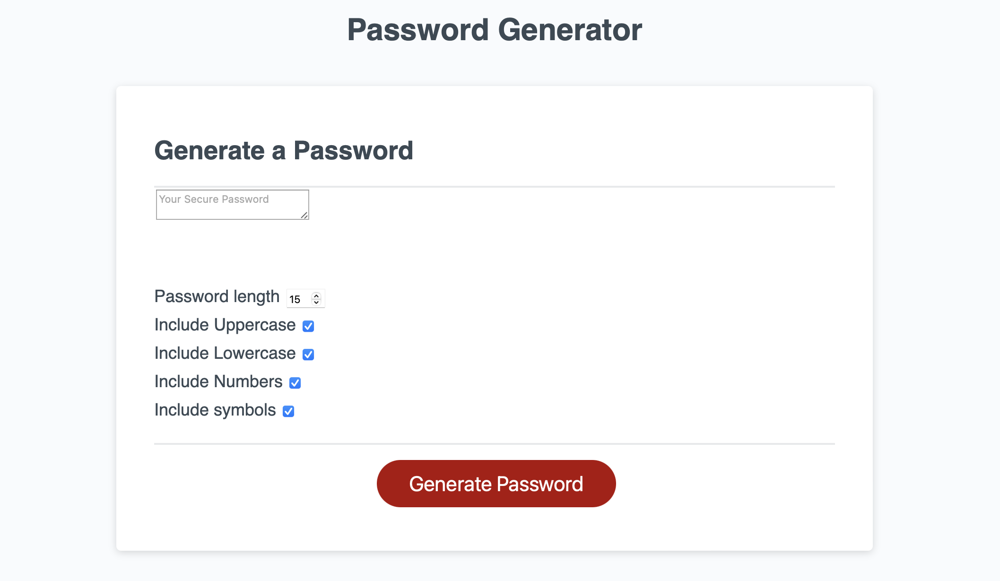

# Random Password Generator

Deployed Site:
https://jared-gg747.github.io/Random-Password-Generator/

The user can create a password anywhere in length of 8 to 128 characters. The password can include:
lowercase, uppercase, numeric, and special characters.

At least one character type must be selected.